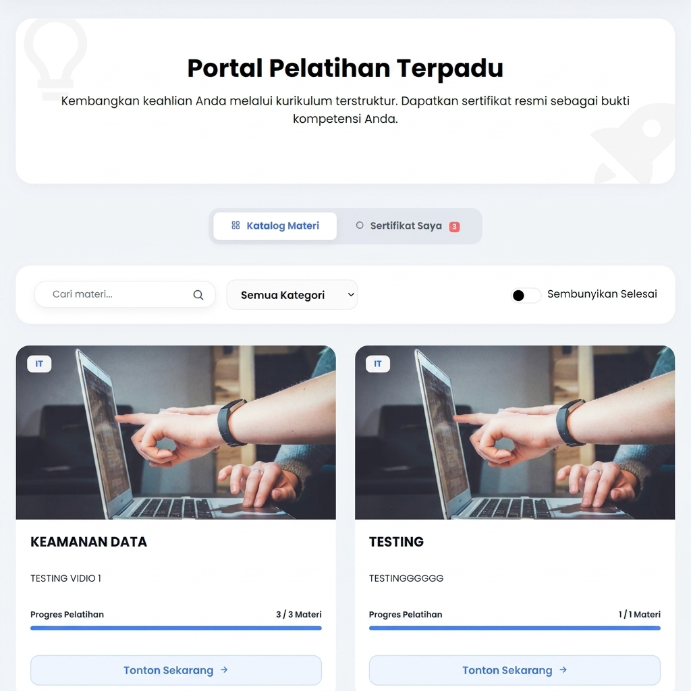
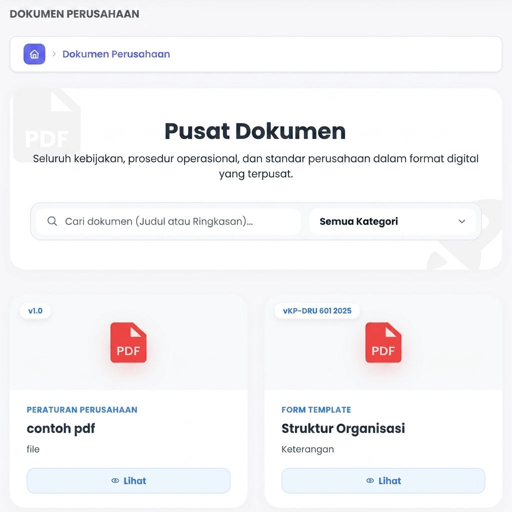
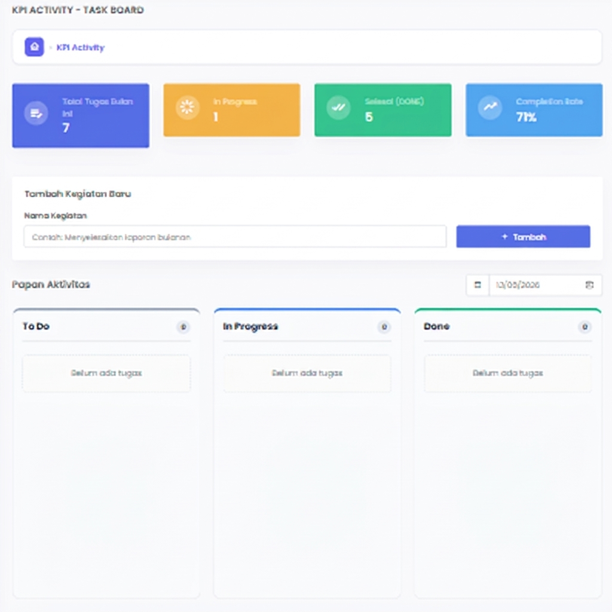

# 🚀 HRPRO — Internal Human Resource Management System

### Internal Human Resource Management System developed during internship experience.

<div align="center">


</div>

---

## 📌 Overview

**HRPRO** is an Enterprise Human Resource Information System (HRIS) designed to automate and centralize various HR operations, including employee management, location-based attendance tracking, payroll processing, learning management, KPI monitoring, and internal company workflows.

During my internship experience, I contributed to several modules including Learning Center, Knowledge Base, Company Documents, and KPI Activity using Laravel, Oracle, and Service Layer architecture.

---

## ✨ Key Features

- 📚 **Learning Center** — Employee learning management system with progress tracking.
- 📈 **KPI Activity** — Daily activity reporting and tracking system.
- 💡 **Knowledge Base** — Employees can search internal company information using keywords.
- 📄 **Company Documents** — Secure internal document management and categorization.
- 🌐 **RESTful API Integration** — API integration for mobile and web-based KPI activity management.

---

## 🛠️ My Contributions

During my internship, I contributed to several core modules, focusing on scalability, clean code, and user experience. Here are the details of my work:

### 📚 Learning Center

- Developed the core features for the employee learning management system.
- Implemented course progress tracking logic.
- Built a workflow for automated certificate generation.
- Organized learning content and categorization for better accessibility.

#### 📸 Preview


### 💡 Knowledge Base

- Developed the internal knowledge base module.
- Implemented keyword-based article search functionality for easier information retrieval.
- Organized article and documentation categories systematically.

### 📄 Company Documents

- Built the company document management module.
- Implemented secure file upload and document categorization.
- Managed document access workflows to ensure security.

#### 📸 Preview


### 📈 KPI Activity

- Developed the employee KPI activity management and monitoring system.
- Built the daily activity submission workflow.
- Implemented activity monitoring and reporting features for management review.

#### 📸 Preview


---

## 🏗️ Tech Stack & Architecture

### ⚙️ Backend & Database

- **PHP** & **Laravel** (MVC Framework)
- **Oracle** (Database)
- **RESTful API**

### 🎨 Frontend

- **Blade Template** (Laravel default templating)
- **Tailwind CSS** (Styling)
- **JavaScript** (Interactivity)

### 📐 Architecture Patterns

- **MVC Architecture**
- **Service Layer Pattern** (Decoupling business logic from controllers)

### 🛠️ Tools & Workflow

- **Git** & **GitLab** (Version control with Feature Branching and Pull Request workflow)
- **Postman** (API Testing)

---

## 🔒 Confidentiality Note

> [!IMPORTANT]
> This repository is a portfolio showcase of my contributions to the HRPRO internal system. Due to company confidentiality policies, only non-sensitive parts of the project are displayed, and some screens have been replaced with dummy data.

---

## 📂 Project Structure

The system follows the Laravel MVC architecture combined with a Service Layer implementation for better maintainability.

```txt
app/
├── Http/
│   ├── Controllers/       # Handles HTTP requests
│   ├── Requests/          # Custom form validation
├── Models/                # Eloquent models
├── Services/              # Business logic (Service Layer)
├── Providers/             # Service providers
```
